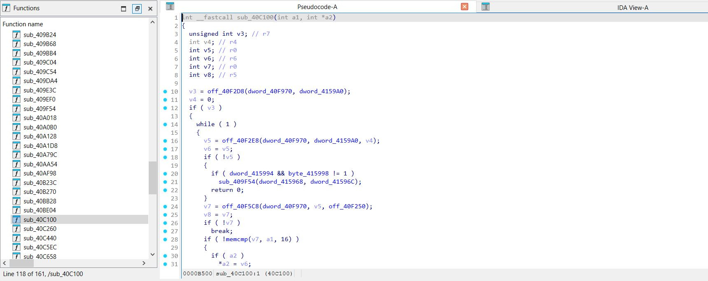
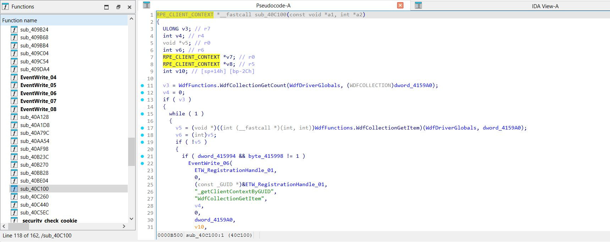
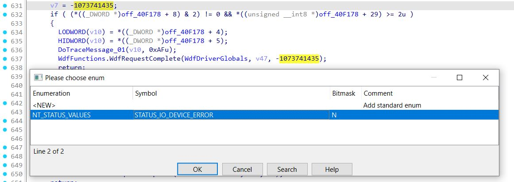
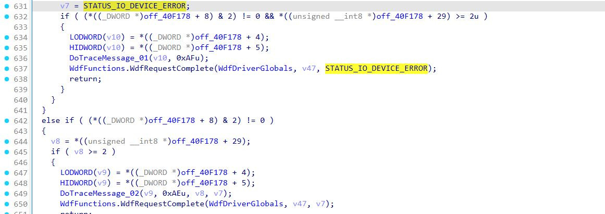
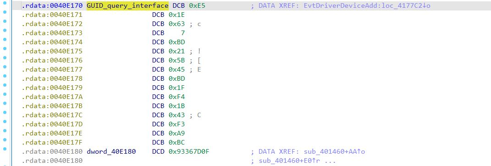
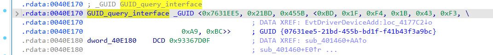

# wp81IdaDriverAnalyzer

This is a highly specialized IDA Pro plugin designed to assist in the reverse engineering of Windows Driver Foundation (WDF) drivers specific to the Windows Phone 8.1 operating system running on Nokia Lumia 520.  

Inspired by [DriverBuddyReloaded](https://github.com/VoidSec/DriverBuddyReloaded).  
Many thanks to [HRDevHelper](https://github.com/patois/HRDevHelper) which helps a lot with IDA's **ctree**.  

## Features

Adds local types, identifies WDF functions, tries to infer types of variables, etc.

:arrow_double_down: **After execution on qcsmd8930.sys** :arrow_double_down:

 
 

:arrow_double_down: **NTSTATUS enumeration**  :arrow_double_down:

 
 

:arrow_double_down: **Adds the _8-4-4-4-12 format with braces_ of a GUID value in a comment** :arrow_double_down:

## Installation and usage

Install the tool by placing the file `wp81IdaDriverAnalyzer.py` and the folder `wp81IdaDriverAnalyzer` into IDA's `plugins` directory. This requires the **ARM decompiler** and is compatible with IDA versions up to **9.x** (it's been tested with IDA Home 9.2).

For a freshly disassembled driver, select **Edit > Plugins > Wp81 Driver Analyzer**.

In the disassembly view, **right-click** to use the `wp81:Set GUID` action.
