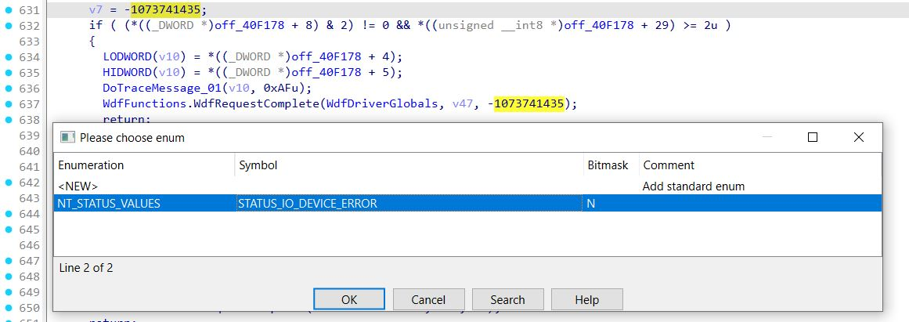
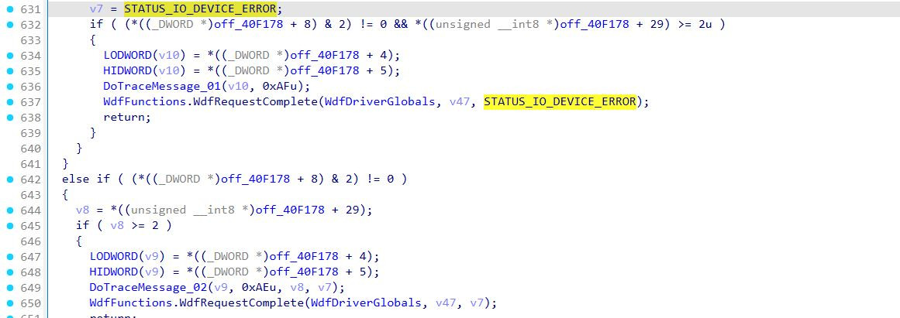
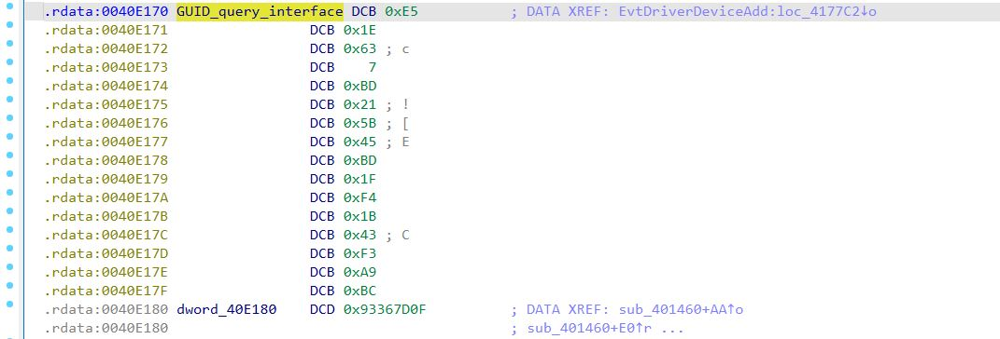
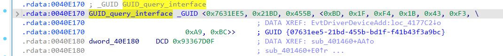

# wp81IdaDriverAnalyzer

Very specific IDA plugin.
Helps the reverse engineering of the WDF drivers of Windows Phone 8.1

## Features

Adds local types, identifies WDF functions, tries to infer types of variables, etc.

:arrow_double_down: after execution on qcsmd8930.sys :arrow_double_down:

:arrow_double_down: NTSTATUS enumeration  :arrow_double_down:

:arrow_double_down: Add a comment with the _8-4-4-4-12 format with braces_ of a GUID value :arrow_double_down:

